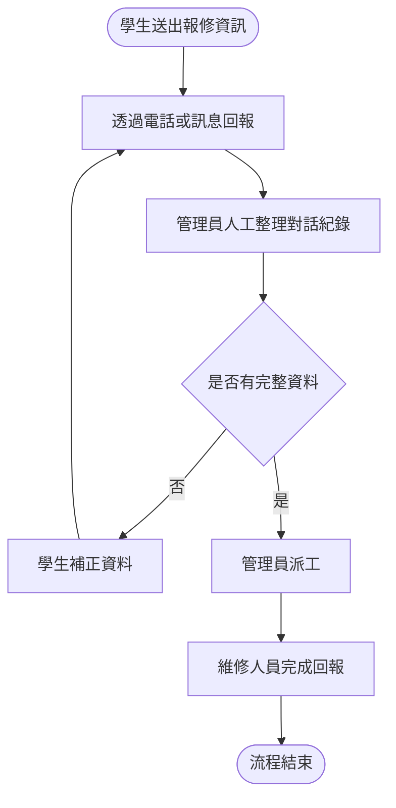
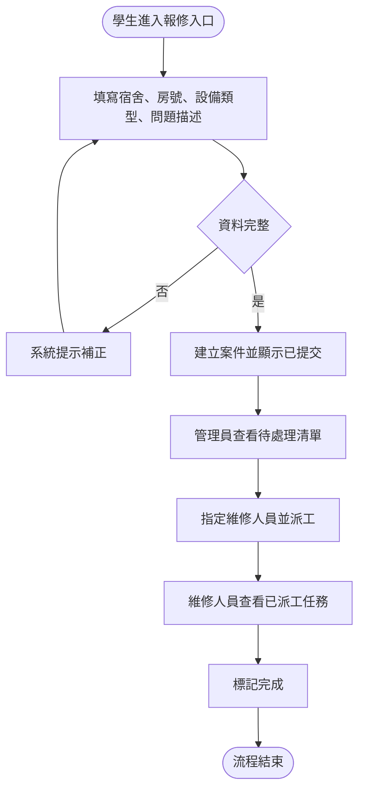

# 現況流程、目標流程與問題改善對照

## 現況流程摘要

現況流程聚焦「學生送出報修 → 管理員整理資訊 → 工作人員回復狀態」的手動流程。

## 現況痛點

| 痛點編號 | 流程位置 | 現象 | 影響 | 來源 | 嚴重度 |
| --- | --- | --- | --- | --- | --- |
| P-01 | 學生回報與管理員整理 | 報修資訊分散於電話、訊息或口頭 | 容易漏失細節、處理效率低 | SRC-STAFF-02、INT-STU-01 | 高 |
| P-02 | 管理員派工前 | 需人工檢查與重複整理案件 | 導致派工前等待時間增加 | OBS-ADM-01 | 高 |
| P-03 | 狀態查詢 | 學生無法直接查詢進度 | 經常反覆詢問，狀態不透明 | INT-STU-02 | 中 |

## 目標流程摘要

## 問題與改善對照

| 痛點 | 目標改善 | 對應需求 | 驗收方式 | 新風險或限制 |
| --- | --- | --- | --- | --- |
| P-01 | 以統一報修入口收集資料 | FR-01、NFR-01 | 可從表單直接提交與顯示案件 | 仍是前端假資料，不代表正式資料整合 |
| P-02 | 管理員清單集中顯示待處理案件 | FR-03、NFR-02 | 可在管理員頁面看到報修案件 | 不處理正式權限與角色驗證 |
| P-03 | 狀態標籤清楚可查看 | FR-02、FR-05 | 狀態從已提交到已派工再到已完成可見 | 不做外部通知 |
